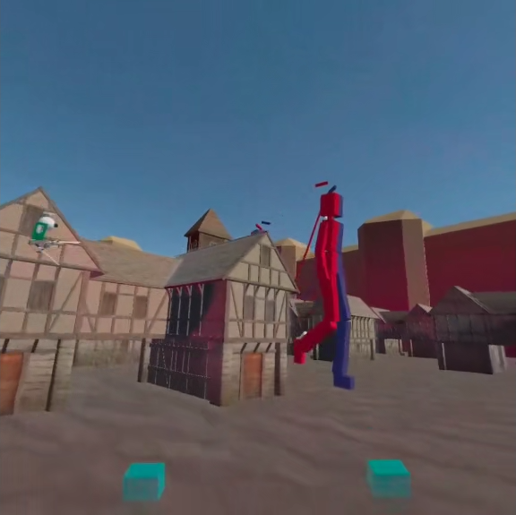

# Attack On Titans VR 
A YouGotOneWeekToDoIt kinda game.

This project has been build within a week as a personal "jam" before moving to another country, my way to say goodbye to my dear Vive. 
The aim was to start playing around with VR developement and have a first contact with game design and technical challenges one faces when producing such a thing.

In a few words :
- Recreation of the AOT experience (3 Dimensional Maneuver Gear, Huge titans, Gaz propulsion)
- Multiplayer with Photon
- VR interaction with VRTK 3.3
- Not very smooth to play but close enough to my vision
- I developed that with only a Vive and other headsets can have some issues (controlers offest / inputs mainly)

Click on that to start the video.

